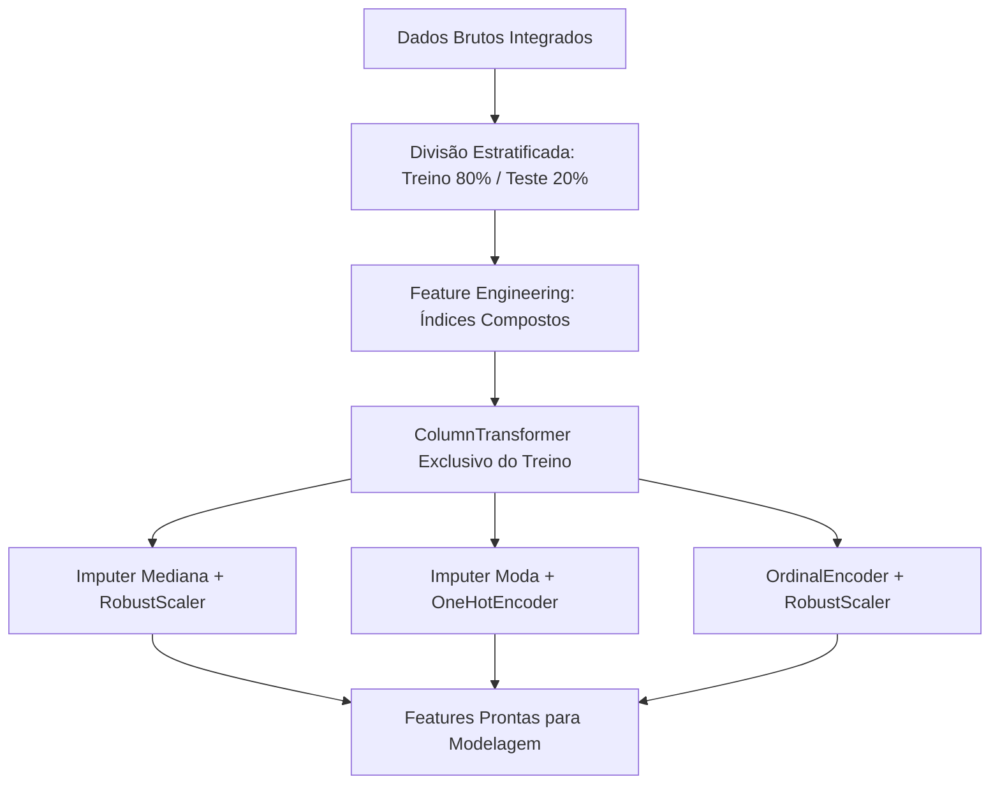

# Tech Challenge (Fase 3) – Predição e Inteligência Analítica para Alfabetização no Brasil


---

## 1. Contexto do Problema

A alfabetização na idade certa (até o final do 2º ano do Ensino Fundamental, por volta dos 7 a 8 anos de idade) é o alicerce mais crítico de toda a trajetória escolar e cidadã de um indivíduo. Crianças não alfabetizadas nessa janela enfrentam defasagens cumulativas de aprendizado, maiores taxas de reprovação e risco acentuado de evasão escolar futura.

No âmbito do **Compromisso Nacional Criança Alfabetizada (CNCA)**, gestores públicos municipais e estaduais enfrentam o desafio de não apenas auditar dados passados de avaliações, mas de **antecipar proativamente quais alunos e redes estão sob risco iminente de não alfabetização**. 

Este projeto desenvolve uma solução completa de Inteligência Analítica e Machine Learning supervisionado para atuar como um **Sistema de Alerta Precoce (*Early Warning System*)**, permitindo alocação eficiente e preventiva de recursos pedagógicos.

---

## 2. Objetivo Analítico

Desenvolver, validar e interpretar um modelo preditivo supervisionado de classificação binária capaz de estimar se um aluno será considerado **Alfabetizado ($y=1$)** ou **Não Alfabetizado ($y=0$)** ao final do 2º ano do Ensino Fundamental, integrando variáveis **educacionais**, **territoriais** e **socioeconômicas**.

### Perguntas de Negócio Respondidas:
1. **Quais fatores possuem maior impacto na probabilidade de alfabetização?**
2. **Qual a importância relativa da escola (fatores intraescolares) versus a vulnerabilidade socioeconômica e territorial?**
3. **Como calibrar o limiar de decisão do modelo para priorizar a proteção de crianças vulneráveis (reduzindo Falsos Negativos)?**
4. **Quais intervenções práticas trazem maior retorno para as secretarias de educação?**
5. **Como identificar municípios em risco educacional e que podem não atingir metas futuras?**

---

## 3. Descrição da Base de Dados

O projeto consome as bases tratadas na **camada Gold e Silver** construídas na Fase 2 do Data Lakehouse, integradas com microdados públicos inspirados no **Censo Escolar (INEP)**, **SAEB**, **CadÚnico / Bolsa Família** e **IBGE**:

* **Fato Alunos e Avaliação:** `data/silver/fato_aluno_alfabetizacao` (mais de 2,12 milhões de registros com presença, série, rede, proficiência e status).
* **Dimensões Escolares:** `data/silver/dim_escola` e `data/gold/ranking_escolas_prioritarias` (infraestrutura básica, saneamento, laboratórios, conectividade e bibliotecas).
* **Dimensões Territoriais:** `data/silver/dim_municipio`, `data/silver/dim_uf`, `data/silver/dominio_regiao_uf` e `data/gold/mapa_calor_territorial` (região, porte do município, IVS territorial).
* **Dimensões Socioeconômicas:** `data/silver/fato_bolsa_familia_municipio` e `data/gold/meta_uf_bolsa_familia` (renda per capita familiar, escolaridade dos pais, recursos pedagógicos domiciliares).

### Atualização da camada medalhão pelo BigQuery

A ingestão é executada neste próprio projeto, usando as mesmas entidades públicas
da Fase 2 (`alunos`, resultados e metas de alfabetização, municípios, UFs e
Bolsa Família). Crie `.env` a partir de `.env.example`, informe o projeto Google
Cloud que realizará o faturamento e autentique-se com Application Default
Credentials (`gcloud auth application-default login`).

```bash
pip install -r requirements.txt
python main.py --medallion --dry-run --skip-ml
python main.py --medallion --skip-ml
```

O primeiro comando apenas estima o volume processado. O segundo grava Bronze,
Silver e Gold em `data/`, com partições `execution_date=AAAA-MM-DD`; o pipeline
de ML seleciona automaticamente a versão Silver mais recente.

---

## 4. Engenharia de Atributos e Pré-processamento (*Zero Data Leakage*)

Para garantir aderência estrita às melhores práticas de engenharia de machine learning em ambientes produtivos, todo o pré-processamento foi encapsulado via `sklearn.compose.ColumnTransformer` e `Pipeline`, garantindo que **nenhuma informação do conjunto de validação ou teste contaminasse o treinamento**:



### Novos Atributos Compostos Criados:
* `indice_infraestrutura_composto`: Combinação ponderada de biblioteca (30%), internet banda larga (25%), laboratório de informática (20%), água filtrada (15%) e quadra de esportes (10%).
* `indice_capital_cultural_casa`: Síntese de escolaridade da mãe (35%), livros em casa (25%), computador/tablet (20%) e internet domiciliar (20%).
* `indice_vulnerabilidade_familiar`: Indicador ponderado de renda per capita invertida, dependência de transferência de renda (Bolsa Família) e IVS territorial.
* `razao_engajamento_turma`: Frequência escolar individual ponderada pela densidade de alunos por turma.

---

## 5. Modelagem e Escolha dos Algoritmos

Foram desenvolvidos e avaliados 4 algoritmos sob protocolo de **Validação Cruzada Estratificada (Stratified 5-Fold CV Zero Leakage)** no conjunto de treino (24.000 registros):

1. **Baseline - Regressão Logística L2:** Modelo linear de referência com regularização Ridge e ponderação balanceada de classes.
2. **Random Forest Classifier:** Ensemble de árvores com amostragem *bootstrap* balanceada (`balanced_subsample`).
3. **XGBoost Classifier:** Algoritmo de gradient boosting escalável com penalização de complexidade.
4. **LightGBM Classifier:** Gradient boosting baseado em histogramas com otimização por folhas (*leaf-wise*), selecionado para otimização fina.

### Otimização Bayesiana de Hiperparâmetros (Optuna):
Executou-se busca bayesiana em 25 trials sobre o LightGBM, otimizando o ROC-AUC em validação cruzada 5-fold, resultando em:
* `learning_rate`: ~0.044
* `max_depth`: 4 | `num_leaves`: 48
* `subsample`: 0.731 | `colsample_bytree`: 0.824
* `reg_alpha` ($L_1$): 1.451 | `reg_lambda` ($L_2$): 0.0079

---

## 6. Métricas de Avaliação e Desempenho no Teste

Avaliação realizada no **conjunto de teste independente (6.000 amostras holdout)**:

| Modelo | Acurácia | ROC-AUC | PR-AUC | F1-Score | Recall (Alfab) | Recall (Não Alfab - Crítico) | Precisão | Brier Score |
| --- | --- | --- | --- | --- | --- | --- | --- | --- |
| **Baseline (Reg. Logística)** | **0.7943** | **0.8805** | **0.8859** | 0.8014 | 79.48% | 79.39% | 80.82% | 0.1403 |
| **LightGBM Otimizado** | **0.7910** | **0.8778** | **0.8842** | 0.7977 | 78.90% | 79.32% | 80.65% | 0.1421 |
| **XGBoost** | **0.7923** | **0.8767** | **0.8831** | 0.8022 | 80.63% | 77.71% | 79.81% | 0.1422 |
| **Random Forest** | 0.7927 | 0.8734 | 0.8760 | 0.8011 | 79.96% | 78.51% | 80.26% | 0.1489 |

### Análise da Matriz de Custo e Ajuste de Limiar (*Threshold Tuning*):

Em projetos educacionais e sociais, **Falsos Negativos possuem custo social desproporcionalmente maior**:

* Ao calibrar o limiar de decisão de **0.50** para o Limiar Social Ótimo (Max $F_2$-score de Risco), a taxa de captura de alunos em risco de não alfabetização salta expressivamente (+9.60 a +16.88 p.p.), reduzindo o risco de abandono pedagógico invisível.

---

## 7. Interpretação dos Resultados e Explicabilidade (SHAP)

A decomposição dos valores SHAP (*TreeExplainer*) revelou o peso relativo de cada pilar explicativo:

* **Pilar Educacional:**
  * A **Frequência Escolar** e a **Formação Docente Superior** são os preditores escolares mais decisivos.
  * A **Razão de Engajamento da Turma** e o acesso a **Biblioteca Escolar e Internet Banda Larga** atuam como fatores protetivos imediatos.
* **Pilar Socioeconômico:**
  * O **Índice de Vulnerabilidade Familiar** e a **Renda Per Capita** exercem forte pressão sobre a taxa de sucesso.
  * A vulnerabilidade econômica é fortemente mitigada quando há capital cultural no domicílio (presença de livros e suporte materno).
* **Pilar Territorial:**
  * Disparidades interestaduais e entre zonas urbana/rural reforçam a necessidade de regimes de colaboração federativa.

---

## 8. Aplicação Prática para Políticas Públicas

1. **Protocolo de Busca Ativa e Monitoramento de Frequência:** Alerta precoce semanal quando a frequência do aluno cair abaixo de 80%, disparando ação conjunta entre escola e assistência social.
2. **Priorização de Infraestrutura Pedagógica:** Investimento focalizado na implantação de bibliotecas e salas de leitura em escolas públicas prioritárias identificadas na camada Gold.
3. **Distribuição Focalizada de Acervo Literário:** Entrega de kits de livros infantis diretamente para famílias inscritas no Cadastro Único / Bolsa Família com crianças no 1º e 2º anos.

---

## 9. Limitações do Projeto

* **Granularidade Amostral:** Necessidade de incorporação contínua de microdados longitudinais que acompanhem o mesmo aluno desde a Educação Infantil até o final do ciclo fundamental.
* **Variáveis Qualitativas Não Observadas:** Aspectos pedagógicos como metodologia de alfabetização adotada e clima escolar não são plenamente capturados em dados quantitativos censitários.

---

## 10. Possíveis Evoluções Futuras

* Implementação de modelos de séries temporais para projeção de metas municipais plurianuais (2025–2030).
* Criação de uma API REST em FastAPI / Docker para integração em tempo real com diários de classe digitais municipais.
* Painel de monitoramento interativo em Streamlit para secretarias estaduais e municipais de educação.

---

## 📂 Estrutura do Repositório (Conforme Edital Oficial)

```
tech-challenge-fase3/
│
├── data/
│   ├── silver/                 # Tabelas limpas e enriquecidas (alunos, escolas, BF)
│   └── gold/                   # Visões analíticas, rankings e metas
│
├── notebooks/                  # Notebooks Jupyter modulares e integrados
│   ├── 01_analise_exploratoria_dados_eda.ipynb
│   ├── 02_engenharia_atributos_preprocessamento.ipynb
│   ├── 03_modelagem_validacao_cruzada_otimizacao.ipynb
│   ├── 04_avaliacao_desempenho_explicabilidade_shap.ipynb
│   └── tech_challenge_alfabetizacao.ipynb
│
├── src/                        # Código-fonte modularizado em subpacotes
│   ├── preprocessing/          # Carga e Pipeline de Feature Engineering
│   │   ├── __init__.py
│   │   ├── data_loader.py
│   │   └── pipeline.py
│   ├── modeling/               # Modelos, CV Zero Leakage e Optuna Tuning
│   │   ├── __init__.py
│   │   ├── models.py
│   │   └── tuning.py
│   ├── evaluation/             # Métricas, Curvas ROC/PR e Threshold Tuning
│   │   ├── __init__.py
│   │   ├── metrics.py
│   │   └── threshold.py
│   ├── visualization/          # Gráficos de EDA e Explicabilidade SHAP
│   │   ├── __init__.py
│   │   ├── eda_plots.py
│   │   └── shap_plots.py
│   ├── __init__.py
│   └── config.py               # Configurações globais e paths centralizados
│
├── reports/
│   ├── figures/                # 12 figuras analíticas em alta resolução
│   └── metrics_summary.json    # Resultados consolidados no teste
│
├── images/                     # Artefatos visuais de apoio para apresentação/vídeo
├── models_saved/               # Modelos treinados serializados (.joblib)
├── main.py                     # Pipeline executável ponta a ponta
├── requirements.txt            # Dependências do projeto
├── .gitignore                  # Arquivo de exclusão de artefatos temporários
└── README.md                   # Documentação executiva completa
```

---

## 🚀 Como Reproduzir o Projeto

```bash
# 1. Clonar o repositório
git clone https://github.com/seu-usuario/tech-challenge-fase3.git
cd tech-challenge-fase3

# 2. Criar e ativar ambiente virtual
python -m venv .venv
source .venv/bin/activate  # No Windows: .venv\Scripts\activate

# 3. Instalar dependências
pip install -r requirements.txt

# 4. Executar pipeline completo (Zero Data Leakage)
python main.py
```
